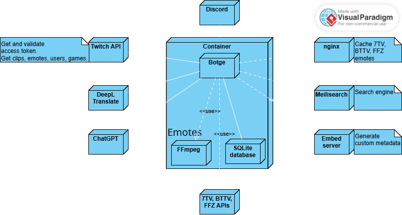

<!-- @format -->

#  Botge

  

## Table of Contents

- [Introduction](#introduction)
- [Features](#features)
- [Usage](#usage)
- [Configuration](#configuration)
- [Documentation](#documentation)
- [License](#license)

## Introduction

Botge is a [Discord](https://discord.com) bot that provides functionalities inspired by the [Twitch](https://www.twitch.tv) chat experience to your server.  
It offers seamless emote handling, Twitch clip searching, and other powerful features that enhance Discord interactions.  
With built-in [DeepL Translation](https://www.deepl.com/en/products/translator), integration with [OpenAI's](https://openai.com) GPT models and [Google's Gemini](https://gemini.google.com) models, Botge makes conversations more dynamic, engaging, and intelligent.

## Features

- **Configuration**: Configure the bot to a streamer with Twitch username and [7TV](https://7tv.app) emote set link.
- **Emote Handling**: Search emotes from platforms: 7TV, [BTTV](https://betterttv.com), [FFZ](https://www.frankerfacez.com) and [Twitch](https://www.twitch.tv), including using overlaying (zero-width) emotes and [Discord emojis](https://github.com/jdecked/twemoji).\
  It fetches global emotes and channel-specific emotes (if specified) from those platforms.
- **Twitch Clip Search**: Search Twitch clips from the 1000 most viewed channel-specific clips.
- **Add Emote**: Add an emote to the emote pool.
- **Shortest unique substring**: Display the shortest unique substring for the specified emote(s) compared to other emotes in the emote pool.
- **ChatGPT Integration**: Interact with OpenAI's GPT models for generating responses.
- **Gemini Integration**: Interact with Google's Gemini models for generating responses.
- **Translation**: Translate text to English using DeepL.
- **Transient Messages**: Send messages that auto-delete after a specified duration.
- **Find the emoji**: Generates an x by x grid where each element is a random, non-animated server emoji hidden in a spoiler tag, with only a single occurrence of the specified emoji.
- **Ping Me**: Pings you after a specified time, optionally with a message.

## Usage

Usage of Botge is straightforward if you are familiar with Discord bot usage.

## Configuration

Configure the bot in the `/settings` command.

## Documentation

More documentation is available in the [docs](docs) folder.

## License

This project is licensed under the MIT License.
