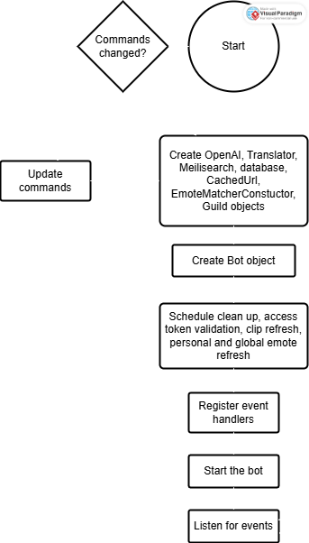
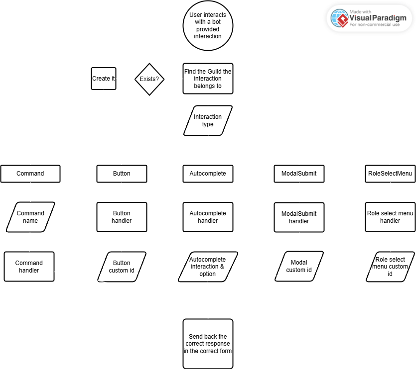

# Documentation

This page shows the developer documentation of Botge.

## Deployment diagram

<figure><figcaption></figcaption></figure>

This diagram outlines the general deployment of Botge.\
It outlines how the bot interacts with other APIs, how it uses technologies to implement the commands.

***

## Bot class diagram

<figure><figcaption></figcaption></figure>

This diagram shows the shortened structure of Botge.\
The central class is Bot, which connects all the other classes together.

***

## Bot start flowchart

<figure><figcaption></figcaption></figure>

This flowchart shows the process of starting the bot.

***

## Interaction flowchart

<figure><figcaption></figcaption></figure>

This flowchart presents how an interaction is processed then converted into an output.

***

## Command outline and dataflow

<figure><figcaption></figcaption></figure>

This dataflow chart is a simple outline of how a command reaches the bot and how the output is sent back to the user.
