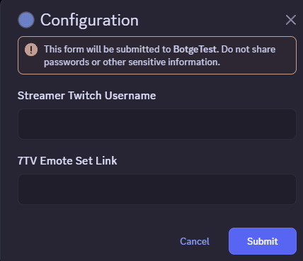

# Configuration

Botge needs extra configuration to customize it to a streamer's emotes and clips.\
While technically it is not required to configure Botge, you won't be able to use `/clip` and won't have personal emotes in commands.


You need owner or administrator permissions to configure Botge!


## Configuration



### Use `/settings` command



### Click on the _Configuration_ button&#x20;



### Input the streamer's Twitch username and their 7TV emote set link



<figure><figcaption></figcaption></figure>


BTTV and FFZ emote sets will be acquired automatically based on Twitch username, if they exist.


***

## Other settings

Botge can be further customized.\
You can set roles which can use the `/settings` command, which roles can add emotes, permit everyone to add emote and you can open the added emote deletion menu from `/settings` .
