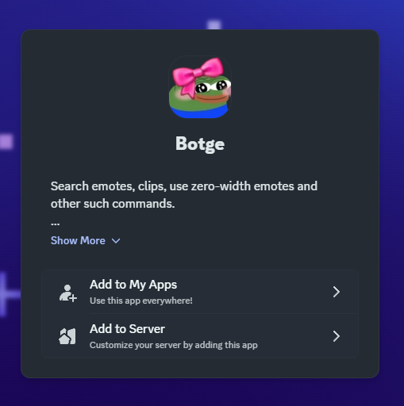

# Invitation

You first have to [invite](https://discord.com/oauth2/authorize?client_id=1298983961992757328) and [optionally configure Botge](configuration.md) in your Discord server, then simply use it.

<figure><figcaption></figcaption></figure>
