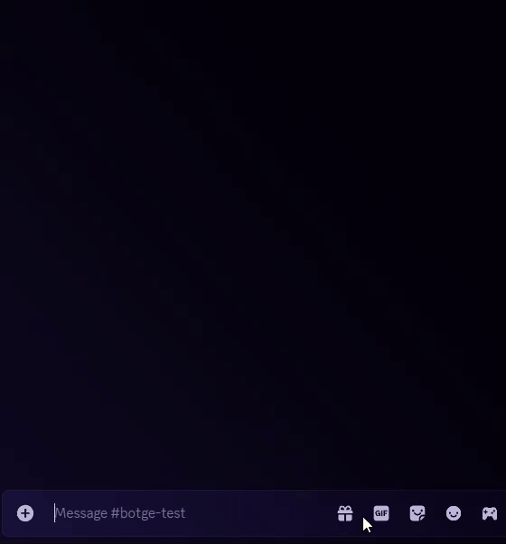

# Usage

Usage of Botge is straightforward if your are familiar with Discord bot usage.

<figure><figcaption></figcaption></figure>


Every command and option has tooltips.


## Basic



### Type `/` and your preferred command's name

You can also select the command from the left hand side menu



### Input the options

Some commands can be used without any options



### Press ENTER



***

## Advanced

In the advanced section we will be going over details that are not in the tooltips.

### **`/emotes`**

It is possible to input discord attachments and tenor gifs as input.

It is possible to input a single letter as part of the input; in this case the letter gets converted to the corresponding Discord letter emoji.

### Autocomplete

Some autocomplete options use other options' inputs to determine their output.

For example: if the `emote` option of `/emote` is filled out, then the `size` option will only show sizes matching that emote.

|          Command         |   Option   |       Relative to option       |
| :----------------------: | :--------: | :----------------------------: |
|           emote          |    name    |               N/A              |
|           emote          |    size    |              name              |
|         emotelist        |    query   | platform, animated, overlaying |
|         emotelist        |  platform  |   query, animated, overlaying  |
|         emotelist        |  animated  |   query, platform, overlaying  |
|         emotelist        | overlaying |    query, platform, animated   |
|           clip           |    title   |        clipper, category       |
|           clip           |   clipper  |         title, category        |
|           clip           |  category  |         title, clipper         |
| shortestuniquesubstrings |   emotes   |               N/A              |
